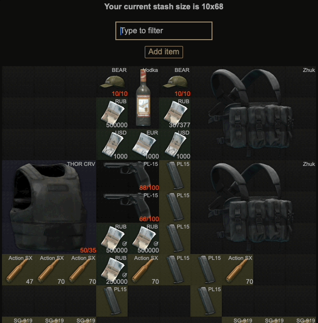

## Tarkov stash

Simple stash editor with a simple UI. If you need more advanced features I recommend to
use [SPT-API Profile editor](https://hub.sp-tarkov.com/files/file/184-spt-aki-profile-editor/)

This is based out of another project of mine: [task-stash-console](https://github.com/angel-git/tarkov-stash-console):

### Features

- Backup your profile
- Set _found in raid_ to items
- Increase stock of items (currency, ammo)
- Restore durability, usage etc from armors, keys, meds...
- Open containers and backpacks (internal layout might be wrong)
- Add items into your stash (beta)
- Add weapons presets into your stash (beta)
- See weapons attachments
- Delete items

### Limitations

- Right now custom items like https://hub.sp-tarkov.com/files/file/488-holtzman-shield/ won't work, **if you have them,
  you can move the items inside your equipped items, like your backpack** and try again.
- The profile you want to edit must be a valid one, ie: you have started the game with that profile and configure your
  character
- Some profile items don't have location and currently breaks the app, still investigating when this happens
- Some images are not accurate as they don't include all attachments
- Some images are not found, since I rely on `https://assets.tarkov.dev` and some IDs don't match for some reason 🤷‍
- Some items show wrong duration (like USEC baseball cap)
- MOA and velocity stats might be wrong depending on your chamber bullets.
- Check the https://github.com/angel-git/tarkov-stash/issues for more

### Future features

- Nothing is planned for now, submit an issue with your ideas!

### Screenshots

#### 0.6.0

New weapon presets:


#### 0.5.2

New add item modal window:


#### 0.5.1

|    Stash on 0.5.0    |    Stash on 0.5.1    |
| :------------------: | :------------------: |
|  |  |

#### 0.5.x0


#### 0.3.x

Keyboard navigation:



Delete item:


#### 0.2.x

Add item:


#### 0.1.x


### Download

> Backup your profile before running this.

Never run any `.exe` file that you have downloaded from internet. Including this. Use it at your own risk.

See the [releases](https://github.com/angel-git/tarkov-stash/releases) page.

### Telemetry

There are features I would like to remove since they make the development slower, since I have no idea if any of you is
using them I decided to add [aptabase](https://aptabase.com), it collects your country and which actions you are doing,
you can see an example of what I see:

This was added on
this [commit](https://github.com/angel-git/tarkov-stash/commit/fda48224ebc93283b6d9b58f9bbb8e69496122cf). If you think
this is against your privacy, you can click on the help menu and disable it :-)

### Development notes

To run on local development mode:

```shell
pnpm tauri dev
```

#### Release

- Update version in `tauri.conf.json`
- Create a new release with proper tag
- Github action will take over and upload the executable
