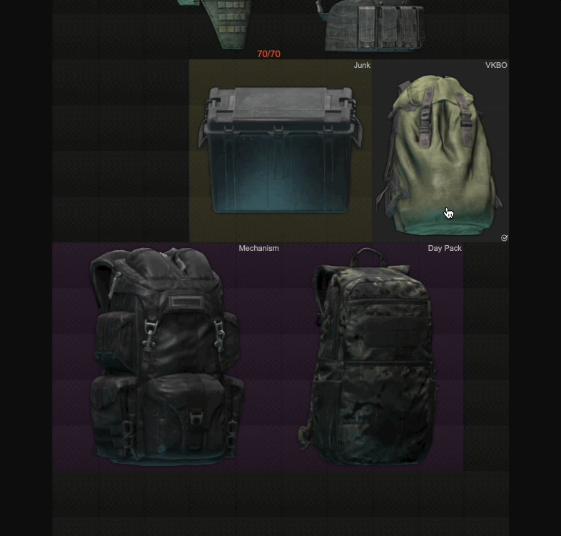

## Tarkov stash

Simple stash editor with a simple UI. If you need more advanced features I recommend to use [SPT-API Profile editor](https://hub.sp-tarkov.com/files/file/184-spt-aki-profile-editor/)

This is based out of another project of mine: [task-stash-console](https://github.com/angel-git/tarkov-stash-console):

### Features

- Backup your profile
- Set _found in raid_ to items
- Increase stock of items (currency, ammo)
- Restore durability, usage etc from armors, keys, meds...
- Open containers and backpacks (internal layout might be wrong)

### Limitations

- Some images are not accurate as they don't include all attachments
- Rotated items don't look nice
- Some items show wrong duration (like USEC baseball cap)

### Future features

- Compatible with 0.3.15 (v1)
- Duplicate items (v1)

### Screenshots




### Download

> Backup your profile before running this.

Never run any `.exe` file that you have downloaded from internet. Including this. Use it at your own risk.

See the [releases](https://github.com/angel-git/tarkov-stash/releases) page.

### Development notes

To run on local development mode:

```shell
pnpm tauri dev
```

#### Release

- Update version in `tauri.conf.json`
- Create a new release with proper tag
- Github action will take over and upload the executable
